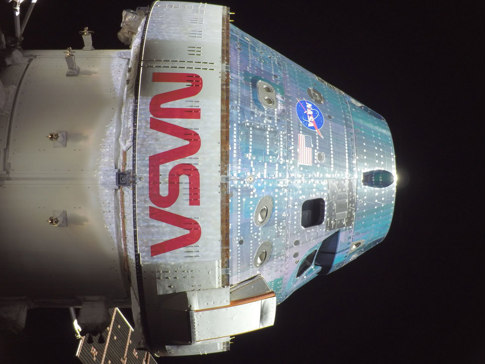
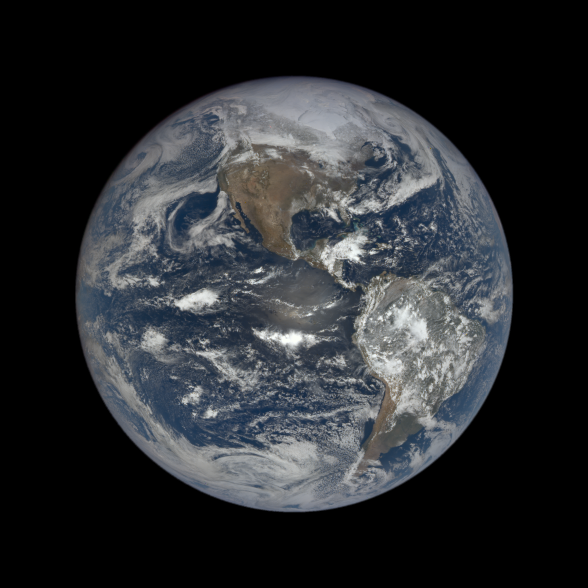

<p align="center">
  
</p>
<p align="center"><i> $100b picture </i></p>

<p align="center">
  <b>"Hello, World"</b> — NASA astronaut Reid Wiseman, Artemis II Commander<br/>
  April 2, 2026 · Orion spacecraft, post-TLI burn · Two auroras, zodiacal light, Earth eclipsing the Sun
</p>

<sub>Nikon D5 · 22mm f/4.0 · ¼s ISO 51200 · 5568×3712 · art002e000192 · 2026-04-03 00:27:39 UTC−05</sub>

---

<p align="center">
  
</p>

<p align="center">
  <b>Orion + Moon</b> — solar array camera, Artemis II Flight Day 2<br/>
  April 3, 2026 · Moon visible behind Orion en route to lunar flyby
</p>

<sub>NASA · iPhone 17 Pro Max · source: NASA social media</sub>

---

<p align="center">
  
</p>

<p align="center">
  <sub>DSCOVR/EPIC · 2026-03-25 18:13:24 UTC · 6.92°N 96.59°W · 1.58M km from Earth · id <code>20260325181812</code><br/>
  source: <a href="https://epic.gsfc.nasa.gov/api/natural/date/2026-03-25">epic.gsfc.nasa.gov/api/natural</a> · DSCOVR J2000 x=1566957 y=21236 z=186509 km</sub>
</p>

---

## orion-status

Real-time Artemis II tracker for your terminal.

<p align="center">
  
</p>

```bash
npm i -g orion-status
```

```
NASA DSN XML ──> CF Durable Object (1s alarm) ──> KV ──> GET /position
JPL Horizons  ──> CF Cron (1s)                 ──> KV ──/
                                                        |
                                              Client (interpolation)
                                                        |
                                              Terminal status line
```

MIT
