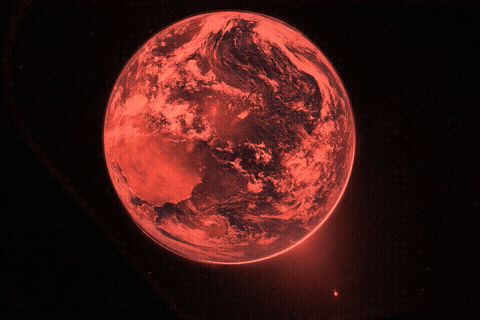
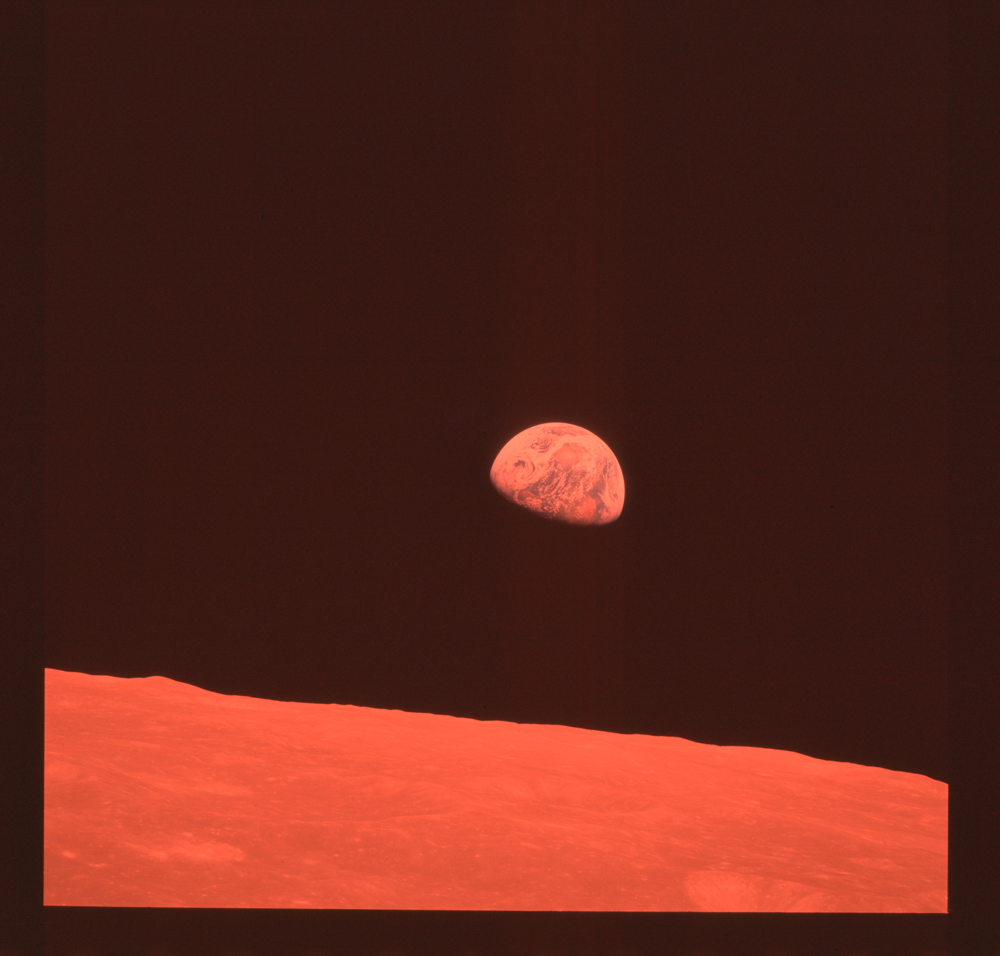
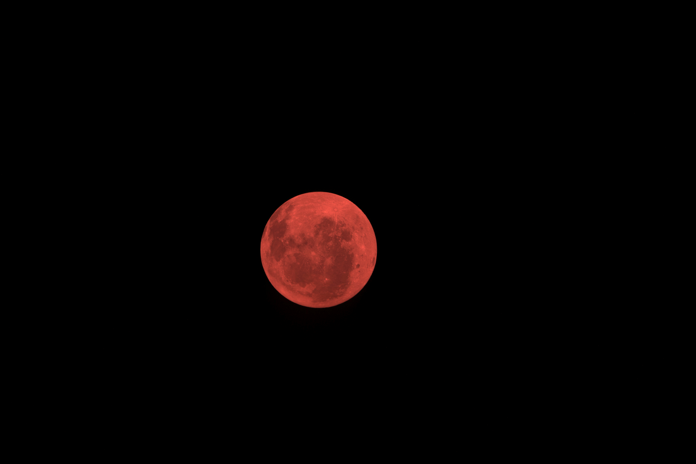
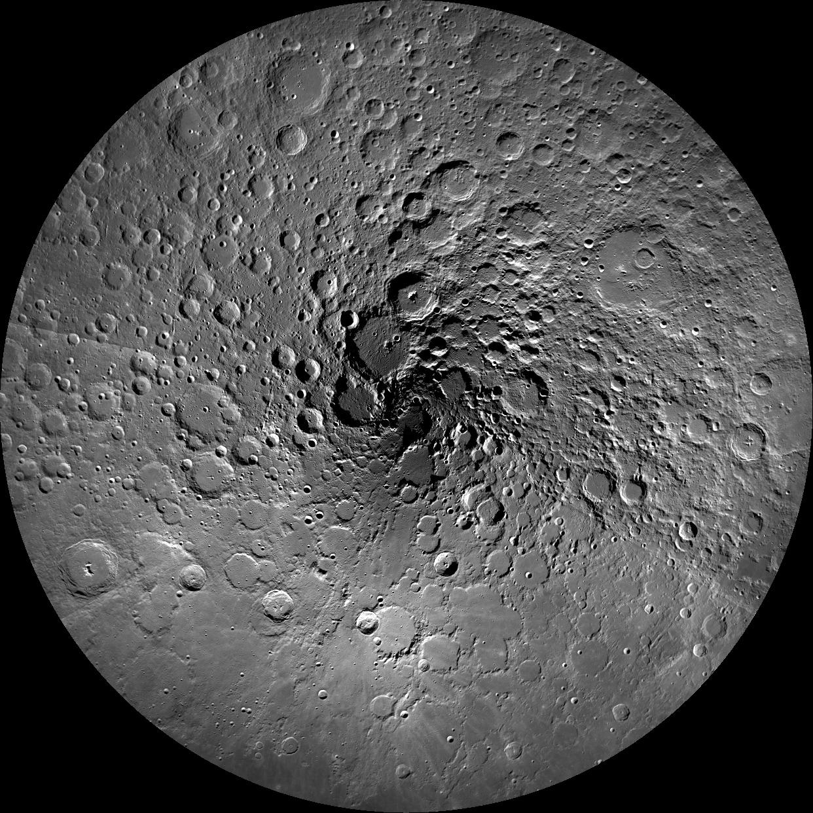

## orion-status

Real-time Artemis II tracker for your terminal.

<p align="center">
  <video src="docs/earthrise-earthset-art002.mp4" autoplay loop muted playsinline width="100%" style="filter: sepia(0.35) brightness(1.12) saturate(1.25)" aria-label="Earthrise and Earthset — Artemis II, April 2026">
    
  </video>
</p>

<sub>NASA Nikon D5 · Artemis II · Earthrise &amp; Earthset from lunar orbit · April 2026 · <b>res-light filter</b></sub>

<p align="center">
  
</p>

```bash
npm i -g orion-status
```

```
NASA DSN XML ──> CF Durable Object (1s alarm) ──> KV ──> GET /position
JPL Horizons  ──> CF Cron (1s)                 ──> KV ──/
                                                        |
                                              Client (interpolation)
                                                        |
                                              Terminal status line
```

MIT

---

<!-- gallery-slideshow hidden while Earthrise is featured
<p align="center">
  
</p>
-->

---

> **Gallery filter:** All images below are rendered with an infrared red tint (channel-shift: R×1.4, G×0.55, B×0.45) inspired by JWST/Spitzer false-color infrared imaging. This is an artistic filter, not scientific data. See [`docs/image-filter.json`](docs/image-filter.json) for full metadata.

<details>
<summary><b>① Earthrise — Apollo 8</b></summary>
<br/>

<p align="center">
  
</p>

<sub>Hasselblad 500 EL · 250mm f/5.6 Sonnar · Kodak Ektachrome SO-368 · 70mm film · 4600×4400 (JSC scan) · AS08-14-2383 · William Anders · 1968-12-24 ~16:40 UTC · <b>infrared-red-tint filter</b></sub>

</details>

<details>
<summary><b>② Orion — The Moon</b></summary>
<br/>

<p align="center">
  
</p>

<sub>Nikon D5 · 400mm f/4.5-5.6 · 1/640s f/18 ISO 500 · 5568×3712 · <a href="https://www.nasa.gov/image-detail/amf-art002e009006/">art002e009006</a> · 2026-04-04 02:03:18 UTC · <b>infrared-red-tint filter</b></sub>

</details>

<details>
<summary><b>③ Orion — Earth</b></summary>
<br/>

<p align="center">
  
</p>

<sub>Nikon D5 · 22mm f/4.0 · ¼s ISO 51200 · 5568×3712 · <a href="https://www.nasa.gov/image-article/hello-world/">art002e000192</a> · 2026-04-03 00:27:39 UTC−05 · <b>infrared-red-tint filter</b></sub>

</details>

<details>
<summary><b>④ Apollo 16 — Lunar Far Side</b></summary>
<br/>

<p align="center">
  
</p>

<sub>Fairchild Metric Camera · 76.2mm · Type 3400 B&W film · 4048×4048 (ASU scan) · AS16-M-3021 · Apollo 16 trans-Earth coast · 1972-04 · <b>infrared-red-tint filter</b></sub>

</details>

<details>
<summary><b>⑤ LRO — Lunar South Pole</b></summary>
<br/>

<p align="center">
  
</p>

<sub>LROC WAC mosaic · 100 m/pixel · 1242×1242 · PIA14024 · Lunar Reconnaissance Orbiter · Shackleton crater visible at center · 2009–2011 · <b>infrared-red-tint filter</b></sub>

</details>
