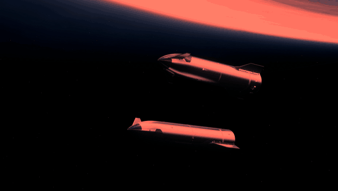
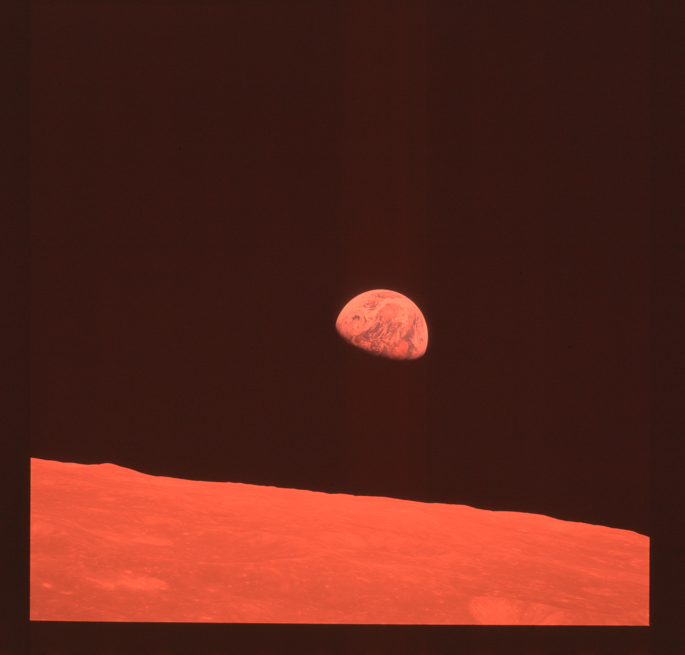
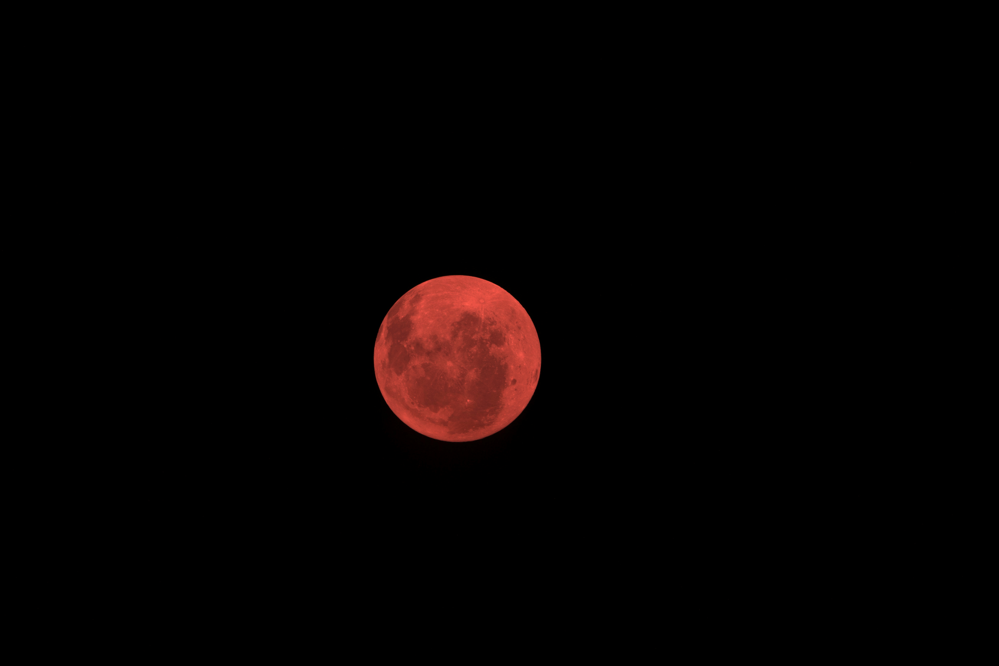
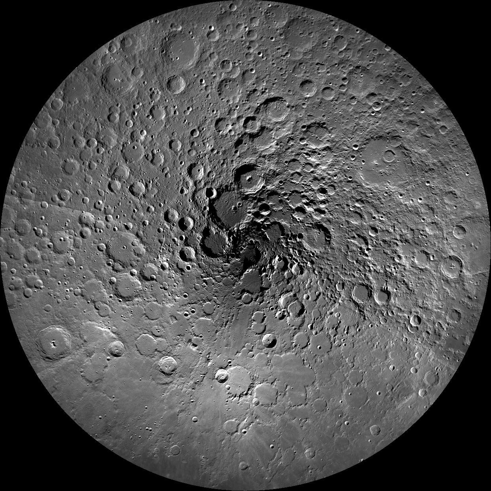

## orion-status
[`docs/schedule.md`](docs/schedule.md) for the full space schedule until launch.

<p align="center">
  
</p>

<sub>Two Starships docked <b>side-by-side, leeward-to-leeward (spine-to-spine)</b> for orbital propellant transfer — the single highest-stakes pass/fail test in the entire Artemis stack. SpaceX's <a href="https://www.spacex.com/updates/starship-v3"><b>Starship V3</b></a> (revealed May 2026) adds <b>four docking drogues on the leeward (bare-stainless) side</b> with co-located propellant-feed connections, and uses <b>DragonEye</b> optical sensors (Dragon/ISS docking heritage) for rendezvous — hardware that locks in the side-by-side, same-direction geometry. Transfer is pumpless: the mated stack thrusts at ~milli-g so RCS <b>ullage settling</b> pools liquid at the aft of both ships while a pressure differential drives the flow. Per Elon Musk on X, the dedicated <b>tanker variant</b> is ~7,000 t liftoff / ~10,000 t thrust (≈3× Saturn V) and delivers <b>~200 t per flight</b>; filling one depot needs <b>~10 tanker flights</b>. Vehicle-to-vehicle cryogenic transfer at 100+ ton scale has never flown — only Flight 3's (2024) internal tank-to-tank slosh demo — and per <a href="https://oig.nasa.gov/wp-content/uploads/2026/03/final-report-ig-26-004-nasas-management-of-the-human-landing-system-contracts.pdf">NASA OIG IG-26-004 (Mar 2026)</a> it remains "one of the most significant technical challenges" facing the program. First true ship-to-ship LEO demo: NET late 2026 — and successful orbital refilling is the gate to the first crewed lunar landing, now <b>Artemis IV (early 2028)</b>, after the Feb-2026 restructure recast Artemis III as a crewed LEO rendezvous/docking demo with no landing. Source: SpaceX's official <a href="https://www.spacex.com/updates/starship-v3">Starship V3</a> propellant-transfer render (May 2026), docking sequence · <b>infrared-red-tint filter baked in</b></sub>

<p align="center">
  
</p>

```bash
npm i -g orion-status
```

```
NASA DSN XML ──> CF Durable Object (1s alarm) ──> KV ──> GET /position
JPL Horizons  ──> CF Cron (1s)                 ──> KV ──/
                                                        |
                                              Client (interpolation)
                                                        |
                                              Terminal status line
```

MIT

---

<!-- gallery-slideshow hidden while Earthrise is featured
<p align="center">
  
</p>
-->

---

> **Gallery filter:** All images below are rendered with an infrared red tint (channel-shift: R×1.4, G×0.55, B×0.45) inspired by JWST/Spitzer false-color infrared imaging. This is an artistic filter, not scientific data. See [`docs/image-filter.json`](docs/image-filter.json) for full metadata.

<details>
<summary><b>① Earthrise — Apollo 8</b></summary>
<br/>

<p align="center">
  
</p>

<sub>Hasselblad 500 EL · 250mm f/5.6 Sonnar · Kodak Ektachrome SO-368 · 70mm film · 4600×4400 (JSC scan) · AS08-14-2383 · William Anders · 1968-12-24 ~16:40 UTC · <b>infrared-red-tint filter</b></sub>

</details>

<details>
<summary><b>② Orion — The Moon</b></summary>
<br/>

<p align="center">
  
</p>

<sub>Nikon D5 · 400mm f/4.5-5.6 · 1/640s f/18 ISO 500 · 5568×3712 · <a href="https://www.nasa.gov/image-detail/amf-art002e009006/">art002e009006</a> · 2026-04-04 02:03:18 UTC · <b>infrared-red-tint filter</b></sub>

</details>

<details>
<summary><b>③ Orion — Earth</b></summary>
<br/>

<p align="center">
  
</p>

<sub>Nikon D5 · 22mm f/4.0 · ¼s ISO 51200 · 5568×3712 · <a href="https://www.nasa.gov/image-article/hello-world/">art002e000192</a> · 2026-04-03 00:27:39 UTC−05 · <b>infrared-red-tint filter</b></sub>

</details>

<details>
<summary><b>④ Apollo 16 — Lunar Far Side</b></summary>
<br/>

<p align="center">
  
</p>

<sub>Fairchild Metric Camera · 76.2mm · Type 3400 B&W film · 4048×4048 (ASU scan) · AS16-M-3021 · Apollo 16 trans-Earth coast · 1972-04 · <b>infrared-red-tint filter</b></sub>

</details>

<details>
<summary><b>⑤ LRO — Lunar South Pole</b></summary>
<br/>

<p align="center">
  
</p>

<sub>LROC WAC mosaic · 100 m/pixel · 1242×1242 · PIA14024 · Lunar Reconnaissance Orbiter · Shackleton crater visible at center · 2009–2011 · <b>infrared-red-tint filter</b></sub>

</details>
